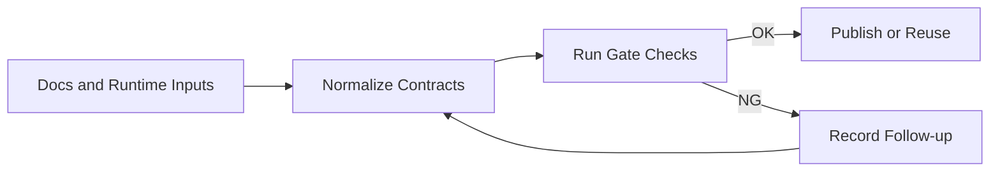

# Blueprint

## 1. Problem Statement

Workflow Cookbook は、AI エージェント作業を文書、実行手順、検収、CI、
Evidence まで一貫して扱うための運用キットである。

現状は機能領域が広がり、Birdseye、Task Seed、Acceptance、Evidence、
workflow plugin、security/release gate がそれぞれ実用段階に入っている。
一方で、リリース情報、CLI 入口、巨大モジュール、plugin capability、
docs gate の成熟段階が散らばると、派生リポジトリが再利用するときに
「どれを正本として信じるか」が分かりにくくなる。

この Blueprint は、Workflow Cookbook を単なる文書集ではなく、
下流 repo が導入しやすい workflow operations toolkit として維持するため、
改善候補を要件・仕様・検証観点へ落とし込む基準を定義する。

## 2. Scope

- In:
  - Birdseye / Codemap、Task Seed、Acceptance、Evidence、reusable CI、
    workflow plugin、security/release evidence の運用契約
  - README / CHANGELOG / release docs / package metadata のバージョン整合
  - 下流 repo が使いやすい CLI entrypoint と既存 script 互換
  - docs gate の warning / failure 昇格ポリシー
  - plugin capability catalog と schema / docs / runtime の同期
  - 巨大モジュール分割計画と技術的負債の追跡
- Out:
  - 外部 SaaS の本番設定
  - Agent_tools 全体の repo routing policy
  - 下流 repo 固有の独自 workflow 要件
  - 既存公開 script を破壊する一括リネーム

## 3. Constraints / Assumptions

- 既存の `python tools/...` 入口は後方互換として維持する。
- 新しい CLI entrypoint は既存 script を薄く呼び出す形から始める。
- gate の failure 昇格は段階制とし、既存 repo を突然壊さない。
- 巨大モジュール分割は仕様・テスト・compat wrapper を先に整え、
  動作を変えない小さな分割から進める。
- plugin capability は runtime 実装、schema、README、sample config の
  4 点が矛盾しないことを重視する。
- release / version 情報は、ユーザー向け表示と package metadata の両方で
  一貫していることをリリース前提とする。

## 4. I/O Contract

- Input:
  - Markdown 正本: `README.md`, `CHANGELOG.md`, `docs/releases/*.md`,
    `docs/requirements.md`, `docs/spec.md`, `RUNBOOK.md`
  - Policy / metadata: `governance/policy.yaml`, `pyproject.toml`,
    `ctg.config.yaml`, `.ctg/suppressions.yaml`
  - Runtime contracts: `schemas/*.schema.json`, `examples/*.json`,
    `tools/workflow_plugins/*`, `tools/protocols/*`
- Output:
  - 検証可能な requirements / spec / acceptance criteria
  - stable CLI entrypoint と既存 script 互換入口
  - version consistency / docs gate / capability catalog の check 結果
  - technical debt register と分割計画
  - release 前に追跡可能な changelog / acceptance / evidence

## 5. Minimal Flow

## 6. Interfaces

- CLI:
  - 既存: `python tools/codemap/update.py`, `python tools/ci/*.py`
  - 将来: package entrypoint 経由の `workflow-cookbook ...`
- Files:
  - `docs/requirements.md`: 要件正本
  - `docs/spec.md`: 仕様正本
  - `docs/CONTRACTS.md`: 外部 feature detection 契約
  - `docs/ci-config.md`: logical gate と concrete check の対応表
  - `TECH_DEBT_REGISTER.md`: 分割計画と抑制理由
- Schemas:
  - `schemas/inference-plugin-config.schema.json`
  - `schemas/workflow-plugin-config.schema.json`
